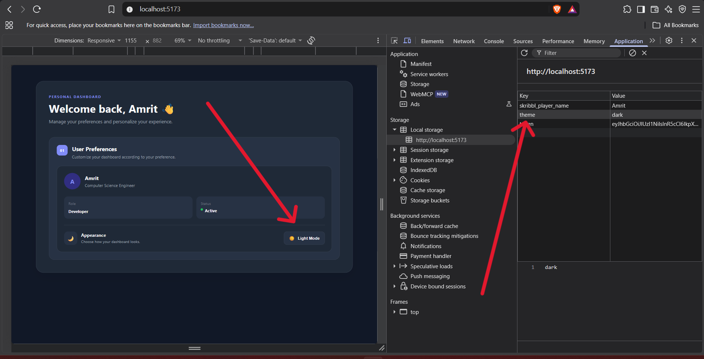
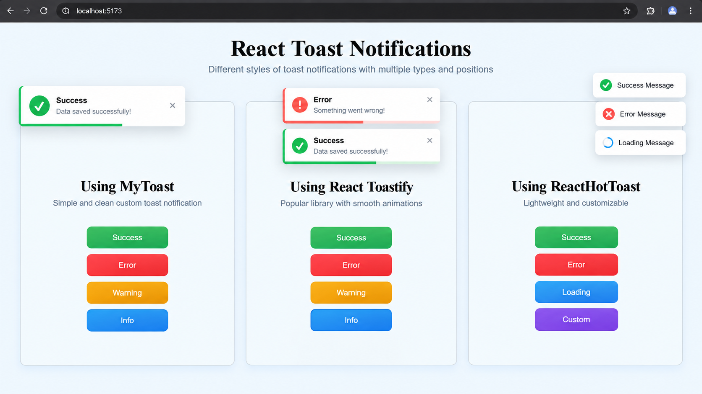

# myHub

A practical **MERN feature lab** where I build small, real-world features
and keep them organized using feature-based architecture.

## Tech Stack

**React • Node.js • Express.js • MongoDB**

## Features

### 01 — Title Notification

Todo manager with a dynamic browser-tab notification for pending tasks.

- Add tasks
- Complete tasks
- MongoDB persistence
- Dynamic pending-task count in browser title


---

### 02 — Theme Toggle

Light/Dark theme switcher that remembers the user's choice after refresh.

- Toggle between Light and Dark mode
- Global theme sharing with Context API
- Dynamic colors using CSS Variables
- Theme persistence with `localStorage`



---

### 03 — Toast Notification

Toast notifications built three ways: a custom toast component from scratch, plus `react-toastify` and `react-hot-toast`.

- Custom toast with Success, Error, Warning, and Info types
- Auto-dismiss with a progress bar and enter/exit animations
- Manual close button
- Library versions using `react-toastify` and `react-hot-toast` (loading and custom toasts)



---

More practical MERN features will be added here as I build them.

```

```