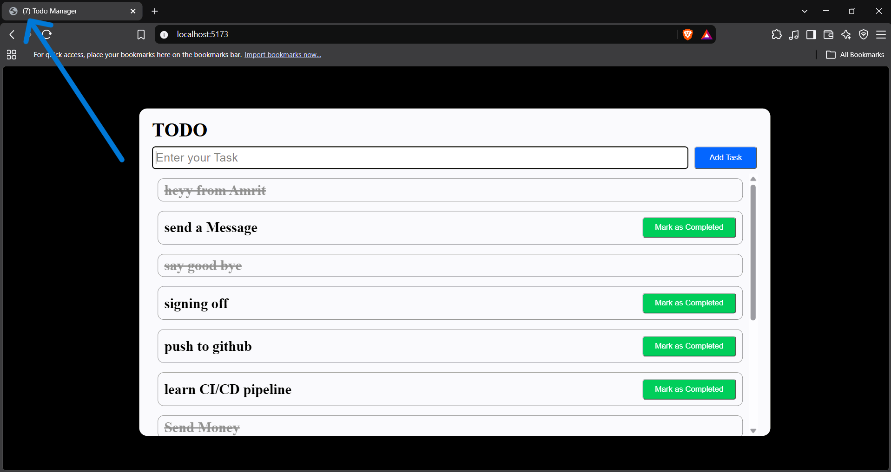

# myHub

A practical **MERN feature lab** where I build small, real-world features
and keep them organized using feature-based architecture.

## Tech Stack

**React • Node.js • Express.js • MongoDB**

## Features

### 01 — Title Notification

Todo manager with a dynamic browser-tab notification for pending tasks.

- Add tasks
- Complete tasks
- MongoDB persistence
- Dynamic pending-task count in browser title

---

More practical MERN features will be added here as I build them.